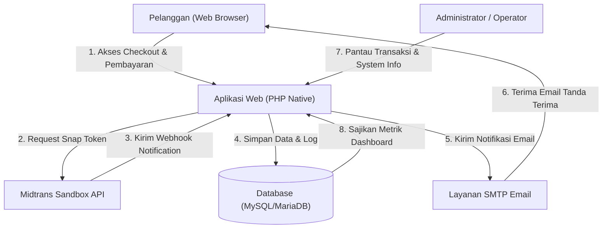
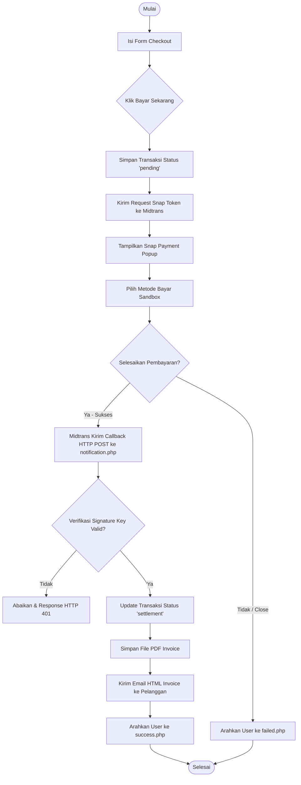
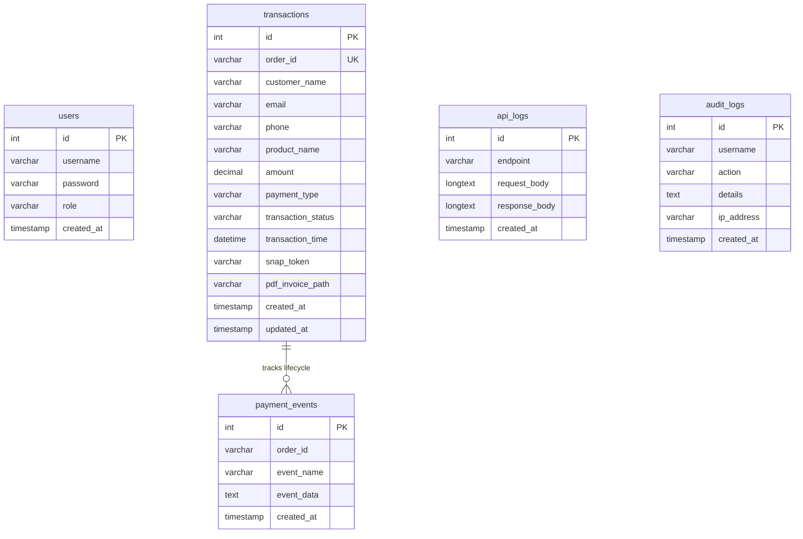
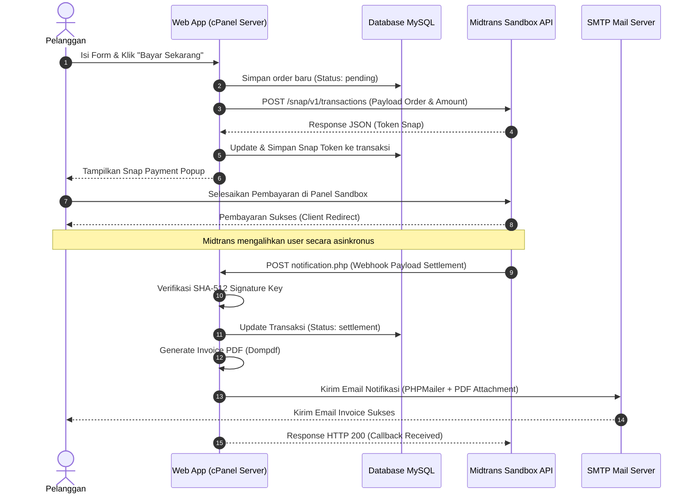

# Dokumentasi Arsitektur Sistem - CloudPay Sandbox

Dokumen ini memuat diagram arsitektur sistem, alur proses pembayaran (flowchart), Entity Relationship Diagram (ERD) database, dan sequence diagram integrasi API.

---

## 1. System Architecture Diagram
Diagram di bawah menunjukkan topologi dan hubungan antar komponen cloud dalam proyek simulasi ini.

---

## 2. Flowchart Pembayaran
Diagram alur proses transaksi dari checkout hingga status pembayaran diperbarui di database.

---

## 3. Database Entity Relationship Diagram (ERD)
Struktur tabel relational database MySQL `payment_sandbox` yang digunakan dalam proyek.

---

## 4. Sequence Diagram API Payment
Urutan interaksi komunikasi antar server (Client-Server & Server-to-Server Webhook).

